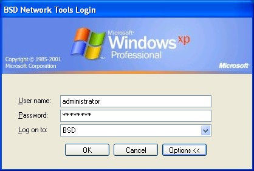



## Login using Network ID and Password

### Description

With the ever increasing use of user id's and passwords it gets harder for a user to remember these all. So why not just allow your applications to use a users PC Login Username and Password.

I have attached a module that I found on Microsofts webpage while surfing the net for exactly that. I have placed a piece of code that shows how to use this module.

I have used it in a Network Tools application I have written to verifiy the administrators or users username and password.

It saves having different usernames and passwords for each application.

A handy addition to any login screen.
 
### More Info
 

             |
---                |---
**Submitted On**   |2006-02-23 03:50:02
**By**             |[Xander75](https://github.com/Planet-Source-Code/PSCIndex/blob/master/ByAuthor/xander75.md)
**Level**          |Advanced
**User Rating**    |4.3 (13 globes from 3 users)
**Compatibility**  |VB 6\.0
**Category**       |[Miscellaneous](https://github.com/Planet-Source-Code/PSCIndex/blob/master/ByCategory/miscellaneous__1-1.md)
**World**          |[Visual Basic](https://github.com/Planet-Source-Code/PSCIndex/blob/master/ByWorld/visual-basic.md)
**Archive File**   |[Login\_usin1975592232006\.zip](https://github.com/Planet-Source-Code/xander75-login-using-network-id-and-password__1-64422/archive/master.zip)

